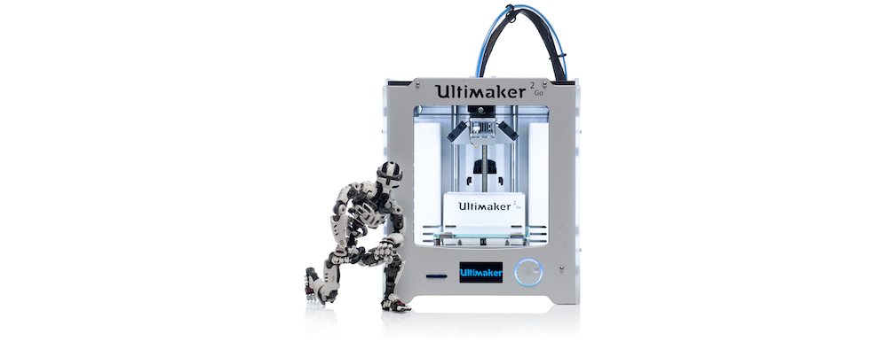

<h1 align="center">Ultimaker 2 Go - Marlin Firmware - 2023 Edtion</h1>

This is the most recent unofficial  Ultimaker 2 Go Firmware, based on the latest bugfix-2.1.x branch. The configurations are based off the Ultimaker 2 provided by Marlin, as found [here](https://github.com/MarlinFirmware/Configurations).

<i><u> The links below are not affiliated!</u></i>

<h2>Hardware mods: </h2>

- [60W Silicone Heated Pad 100x100mm integrated NTC100K thermistor](https://nl.aliexpress.com/item/1005004519596065.html?channel=twinner)
 Because the thermistor is not a PT100, I've used A0 on the Ultimaker 2.1.4 motherboard. The pin-number is changed accordingly in the config. For more information on this topic, [read this](https://community.ultimaker.com/topic/10348-k-type-thermistor-on-um2-new-pin-assignment-and-code/).

- [Hot-End Isolator Coupler PTFE Tube for 1.75mm](https://nl.aliexpress.com/item/32677112434.html?channel=twinner) (Only recommended if you're planning to use strictly filament with a diameter of 1.75mm . You'll need to change your filament diameter in your slicer of choice. The firmware still expects 2.85mm.
 

<h2>Config changes</h2>

I've used the Ultimaker 2 as the base config and changed everything to fit the Ultimaker 2 Go. I've also utilized some (new) Marlin firmware features.

<b>Pro Tip</b>: Make sure to do a PID-tune for both your hotend and bed

<h3>configuration.h</h3>

- PIDTEMPBED = TRUE
- PID_EDIT_MENU  = TRUE
- PID_AUTOTUNE_MENU = TRUE
- EXTRUDE_MAXLENGTH = 1000
- X_MIN_POS = -16
- LCD_BED_LEVELING = TRUE
- LCD_BED_TRAMMING = TRUE
- BED_TRAMMING_INSET_LFRB = { 20, 20, 20, 20 }
- BED_TRAMMING_INCLUDE_CENTER = TRUE
- BED_TRAMMING_LEVELING_ORDER { LF, RF }

<h4>Preheat constants:</h4>

	#define PREHEAT_1_LABEL       "PLA"
	#define PREHEAT_1_TEMP_HOTEND 200
	#define PREHEAT_1_TEMP_BED     60
	#define PREHEAT_1_TEMP_CHAMBER  0
	#define PREHEAT_1_FAN_SPEED     0 // Value from 0 to 255

	#define PREHEAT_2_LABEL       "PETG"
	#define PREHEAT_2_TEMP_HOTEND 220
	#define PREHEAT_2_TEMP_BED     60
	#define PREHEAT_2_TEMP_CHAMBER  0
	#define PREHEAT_2_FAN_SPEED     0 // Value from 0 to 255

	#define PREHEAT_3_LABEL       "ABS"
	#define PREHEAT_3_TEMP_HOTEND 230
	#define PREHEAT_3_TEMP_BED     70
	#define PREHEAT_3_TEMP_CHAMBER  0
	#define PREHEAT_3_FAN_SPEED     0 // Value from 0 to 255

- PRINTCOUNTER = TRUE
- INDIVIDUAL_AXIS_HOMING_MENU = TRUE
- INDIVIDUAL_AXIS_HOMING_SUBMENU = TRUE

<h3>configuration_adv.h</h3>

- CASE_LIGHT_ENABLE = TRUE
- CASE_LIGHT_MENU = TRUE
- NO_SD_AUTOSTART = TRUE
- ONE_CLICK_PRINT = TRUE
- SCROLL_LONG_FILENAMES = TRUE
- BABYSTEPPING = TRUE
- BABYSTEP_WITHOUT_HOMING = TRUE
- BABYSTEP_ALWAYS_AVAILABLE = TRUE
- FILAMENT_CHANGE_UNLOAD_LENGTH = 590
- FILAMENT_CHANGE_FAST_LOAD_LENGTH = 560
- SOUND_ON_DEFAULT = FALSE
- PWM_MOTOR_CURRENT { 1300, 1300, 1400 }

 

<b>pins_ULTIMAIN_2.h</b>
- TEMP_BED_PIN = 0

 

 

<h1 align="center">Marlin 3D Printer Firmware</h1>

    
    
    
    
    
     
    

Additional documentation can be found at the [Marlin Home Page](https://marlinfw.org/).
Please test this firmware and let us know if it misbehaves in any way. Volunteers are standing by!

## Marlin 2.1 Bugfix Branch

__Not for production use. Use with caution!__

Marlin 2.1 takes this popular RepRap firmware to the next level by adding support for much faster 32-bit and ARM-based boards while improving support for 8-bit AVR boards. Read about Marlin's decision to use a "Hardware Abstraction Layer" below.

This branch is for patches to the latest 2.1.x release version. Periodically this branch will form the basis for the next minor 2.1.x release.

Download earlier versions of Marlin on the [Releases page](https://github.com/MarlinFirmware/Marlin/releases).

## Example Configurations

Before you can build Marlin for your machine you'll need a configuration for your specific hardware. Upon request, your vendor will be happy to provide you with the complete source code and configurations for your machine, but you'll need to get updated configuration files if you want to install a newer version of Marlin. Fortunately, Marlin users have contributed dozens of tested configurations to get you started. Visit the [MarlinFirmware/Configurations](https://github.com/MarlinFirmware/Configurations) repository to find the right configuration for your hardware.

## Building Marlin 2.1

To build and upload Marlin you will use one of these tools:

- The free [Visual Studio Code](https://code.visualstudio.com/download) using the [Auto Build Marlin](https://marlinfw.org/docs/basics/auto_build_marlin.html) extension.
- The free [Arduino IDE](https://www.arduino.cc/en/main/software) : See [Building Marlin with Arduino](https://marlinfw.org/docs/basics/install_arduino.html)
- You can also use VSCode with devcontainer : See [Installing Marlin (VSCode devcontainer)](http://marlinfw.org/docs/basics/install_devcontainer_vscode.html).

Marlin is optimized to build with the **PlatformIO IDE** extension for **Visual Studio Code**. You can still build Marlin with **Arduino IDE**, and we hope to improve the Arduino build experience, but at this time PlatformIO is the better choice.

## Hardware Abstraction Layer (HAL)

Marlin includes an abstraction layer to provide a common API for all the platforms it targets. This allows Marlin code to address the details of motion and user interface tasks at the lowest and highest levels with no system overhead, tying all events directly to the hardware clock.

Every new HAL opens up a world of hardware. At this time we need HALs for RP2040 and the Duet3D family of boards. A HAL that wraps an RTOS is an interesting concept that could be explored. Did you know that Marlin includes a Simulator that can run on Windows, macOS, and Linux? Join the Discord to help move these sub-projects forward!

## 8-Bit AVR Boards

A core tenet of this project is to keep supporting 8-bit AVR boards while also maintaining a single codebase that applies equally to all machines. We want casual hobbyists to benefit from the community's innovations as much as possible just as much as those with fancier machines. Plus, those old AVR-based machines are often the best for your testing and feedback!

### Supported Platforms

  Platform|MCU|Example Boards
  --------|---|-------
  [Arduino AVR](https://www.arduino.cc/)|ATmega|RAMPS, Melzi, RAMBo
  [Teensy++ 2.0](https://www.microchip.com/en-us/product/AT90USB1286)|AT90USB1286|Printrboard
  [Arduino Due](https://www.arduino.cc/en/Guide/ArduinoDue)|SAM3X8E|RAMPS-FD, RADDS, RAMPS4DUE
  [ESP32](https://github.com/espressif/arduino-esp32)|ESP32|FYSETC E4, E4d@BOX, MRR
  [LPC1768](https://www.nxp.com/products/processors-and-microcontrollers/arm-microcontrollers/general-purpose-mcus/lpc1700-cortex-m3/512-kb-flash-64-kb-sram-ethernet-usb-lqfp100-package:LPC1768FBD100)|ARM® Cortex-M3|MKS SBASE, Re-ARM, Selena Compact
  [LPC1769](https://www.nxp.com/products/processors-and-microcontrollers/arm-microcontrollers/general-purpose-mcus/lpc1700-cortex-m3/512-kb-flash-64-kb-sram-ethernet-usb-lqfp100-package:LPC1769FBD100)|ARM® Cortex-M3|Smoothieboard, Azteeg X5 mini, TH3D EZBoard
  [STM32F103](https://www.st.com/en/microcontrollers-microprocessors/stm32f103.html)|ARM® Cortex-M3|Malyan M200, GTM32 Pro, MKS Robin, BTT SKR Mini
  [STM32F401](https://www.st.com/en/microcontrollers-microprocessors/stm32f401.html)|ARM® Cortex-M4|ARMED, Rumba32, SKR Pro, Lerdge, FYSETC S6, Artillery Ruby
  [STM32F7x6](https://www.st.com/en/microcontrollers-microprocessors/stm32f7x6.html)|ARM® Cortex-M7|The Borg, RemRam V1
  [STM32G0B1RET6](https://www.st.com/en/microcontrollers-microprocessors/stm32g0x1.html)|ARM® Cortex-M0+|BigTreeTech SKR mini E3 V3.0
  [STM32H743xIT6](https://www.st.com/en/microcontrollers-microprocessors/stm32h743-753.html)|ARM® Cortex-M7|BigTreeTech SKR V3.0, SKR EZ V3.0, SKR SE BX V2.0/V3.0
  [SAMD51P20A](https://www.adafruit.com/product/4064)|ARM® Cortex-M4|Adafruit Grand Central M4
  [Teensy 3.5](https://www.pjrc.com/store/teensy35.html)|ARM® Cortex-M4|
  [Teensy 3.6](https://www.pjrc.com/store/teensy36.html)|ARM® Cortex-M4|
  [Teensy 4.0](https://www.pjrc.com/store/teensy40.html)|ARM® Cortex-M7|
  [Teensy 4.1](https://www.pjrc.com/store/teensy41.html)|ARM® Cortex-M7|
  Linux Native|x86/ARM/etc.|Raspberry Pi

## Submitting Patches

Proposed patches should be submitted as a Pull Request against the ([bugfix-2.1.x](https://github.com/MarlinFirmware/Marlin/tree/bugfix-2.1.x)) branch.

- This branch is for fixing bugs and integrating any new features for the duration of the Marlin 2.1.x life-cycle.
- Follow the [Coding Standards](https://marlinfw.org/docs/development/coding_standards.html) to gain points with the maintainers.
- Please submit Feature Requests and Bug Reports to the [Issue Queue](https://github.com/MarlinFirmware/Marlin/issues/new/choose). Support resources are also listed there.
- Whenever you add new features, be sure to add tests to `buildroot/tests` and then run your tests locally, if possible.
  - It's optional: Running all the tests on Windows might take a long time, and they will run anyway on GitHub.
  - If you're running the tests on Linux (or on WSL with the code on a Linux volume) the speed is much faster.
  - You can use `make tests-all-local` or `make tests-single-local TEST_TARGET=...`.
  - If you prefer Docker you can use `make tests-all-local-docker` or `make tests-all-local-docker TEST_TARGET=...`.

## Marlin Support

The Issue Queue is reserved for Bug Reports and Feature Requests. To get help with configuration and troubleshooting, please use the following resources:

- [Marlin Documentation](https://marlinfw.org) - Official Marlin documentation
- [Marlin Discord](https://discord.gg/n5NJ59y) - Discuss issues with Marlin users and developers
- Facebook Group ["Marlin Firmware"](https://www.facebook.com/groups/1049718498464482/)
- RepRap.org [Marlin Forum](https://forums.reprap.org/list.php?415)
- Facebook Group ["Marlin Firmware for 3D Printers"](https://www.facebook.com/groups/3Dtechtalk/)
- [Marlin Configuration](https://www.youtube.com/results?search_query=marlin+configuration) on YouTube

## Contributors

Marlin is constantly improving thanks to a huge number of contributors from all over the world bringing their specialties and talents. Huge thanks are due to [all the contributors](https://github.com/MarlinFirmware/Marlin/graphs/contributors) who regularly patch up bugs, help direct traffic, and basically keep Marlin from falling apart. Marlin's continued existence would not be possible without them.

## Administration

Regular users can open and close their own issues, but only the administrators can do project-related things like add labels, merge changes, set milestones, and kick trolls. The current Marlin admin team consists of:

<table align="center">
<tr><td>Project Maintainer</td></tr>
<tr><td>

 🇺🇸  **Scott Lahteine**
       [@thinkyhead](https://github.com/thinkyhead)
       [<kbd>  Donate 💸  </kbd>](https://www.thinkyhead.com/donate-to-marlin)

</td><td>

 🇺🇸  **Roxanne Neufeld**
       [@Roxy-3D](https://github.com/Roxy-3D)

 🇺🇸  **Keith Bennett**
       [@thisiskeithb](https://github.com/thisiskeithb)
       [<kbd>  Donate 💸  </kbd>](https://github.com/sponsors/thisiskeithb)

 🇺🇸  **Jason Smith**
       [@sjasonsmith](https://github.com/sjasonsmith)

</td><td>

 🇧🇷  **Victor Oliveira**
       [@rhapsodyv](https://github.com/rhapsodyv)

 🇬🇧  **Chris Pepper**
       [@p3p](https://github.com/p3p)

🇳🇿  **Peter Ellens**
       [@ellensp](https://github.com/ellensp)
       [<kbd>  Donate 💸  </kbd>](https://ko-fi.com/ellensp)

</td><td>

 🇺🇸  **Bob Kuhn**
       [@Bob-the-Kuhn](https://github.com/Bob-the-Kuhn)

 🇳🇱  **Erik van der Zalm**
       [@ErikZalm](https://github.com/ErikZalm)
       [<kbd>  Donate 💸  </kbd>](https://flattr.com/submit/auto?user_id=ErikZalm&url=https://github.com/MarlinFirmware/Marlin&title=Marlin&language=&tags=github&category=software)

</td></tr>
</table>

## License

Marlin is published under the [GPL license](/LICENSE) because we believe in open development. The GPL comes with both rights and obligations. Whether you use Marlin firmware as the driver for your open or closed-source product, you must keep Marlin open, and you must provide your compatible Marlin source code to end users upon request. The most straightforward way to comply with the Marlin license is to make a fork of Marlin on Github, perform your modifications, and direct users to your modified fork.

While we can't prevent the use of this code in products (3D printers, CNC, etc.) that are closed source or crippled by a patent, we would prefer that you choose another firmware or, better yet, make your own.
